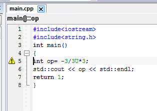
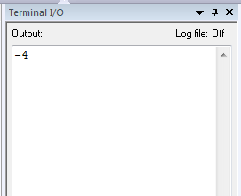
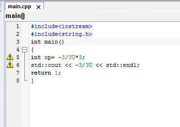
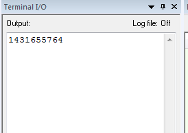
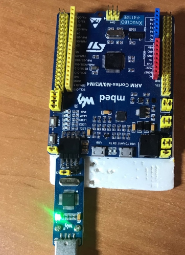
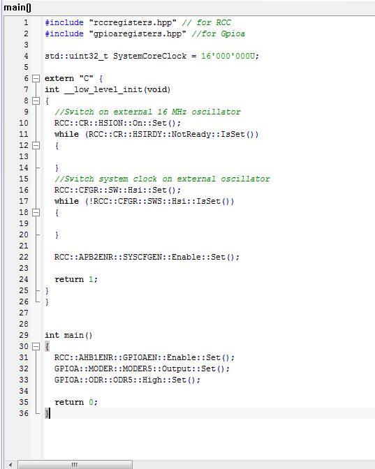
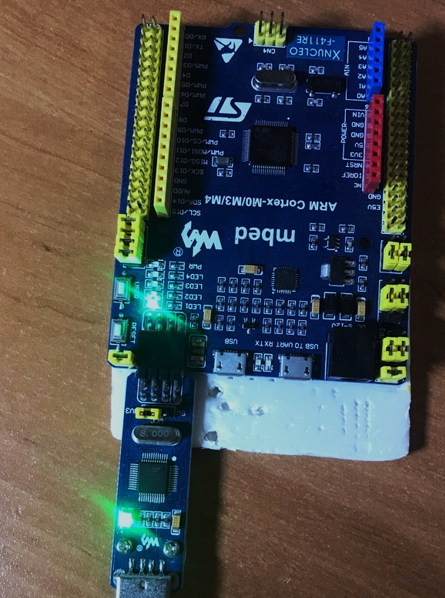

:imagesdir: Images

= **Лабараторная работа №1**

== *Задание:*

1) Написать программу вычисляющую следующее выражение -3/3U *3 и объяснить результат.

2) Подключить плату к домашнему компьютеру, проверить что все работает, плата прошивается.

3) Запустить на плате проект Lab1 и добавить в main код для зажигания светодиодов, представленный ниже (не забыть
подключить бибилиотеку GPIOA):

RCC::AHB1ENR::GPIOAEN::Enable::Set();
GPIOA::MODER::MODER5::Output::Set();
GPIOA::ODR::ODR5::High::Set();

4) Пронаблюдать происходящее на плате и зафиксировать в виде фотографии.

== 1) Программа:
Код программы вычисляющий выражение -3/3U *3 и итог в Terminal I/O

и итог

-4 говорит о том, что число превысило диапозон записи числа, молл оно не влезло в битовую запись. И начало отсчет
заново.
Посмотрим что выводит часть выражения в 3 раза меньше данной, то есть  -3/3U:

И вывод результата программы в окне Terminal I/O:

Соответственно видем число 1431655764. А если его умножим на 3, получим 4 294 967 292
А наполняемость ячейки равна 2^32=4 294 967 296. А, 4 294 967 294-4 294 967 296=-4. Такое значение и получили на
компьютере.

== 2) Подключение платы
Подключим плату к компьютеру через разьем USB. При подключение загорается красный светодиод. Это означает что плата
подключена и готова к прошивке.

== 3) Запуск платы
Следует создать проект и в настройках проекта выберать плату ST STM32F411RE. После запуска программы, на плате
загорается зеленный светодиод. Как я понял который говорит о том что данная программа прошила плату.

== 4) Наблюдение за платой
Для включения светодиода воспользую код из задания, предварительно необходимо
включить библиотеки, чтобы всё работало.

Результатом данной программы является загорание еще одного светодиода на плате.

